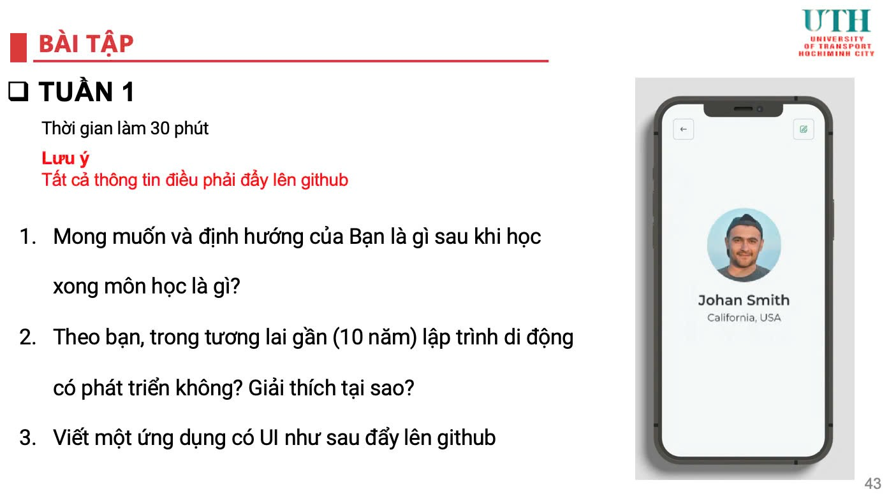
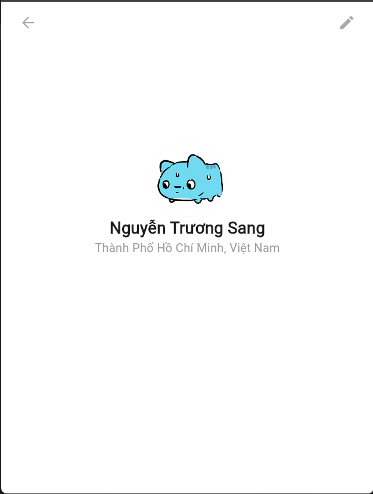

Câu hỏi 1: Mong muốn và định hướng của bạn là gì sau khi học xong môn học là gì ?
A: Hiện tại em đang hướng tới Fullstack Web Developer (Chủ yếu thiên về BE hơn, nhưng cũng có thể làm FE), nếu như môn này em học ổn thì em nghĩ mình sẽ hướng đến Fullstack Developer để sau này có nhiều cơ hội việc làm hơn.
Câu hỏi 2: Theo bạn, trong tương lai gần (10 năm) lập trình di động có phát triển không? Giải thích tại sao?
A: Theo em thì sẽ có. Bởi vì công nghệ thì liên tục phát triển, nhu cầu sử dụng điện thoại trong đời sống hàng ngày thì rất cao => Cần nhiều devs trong lĩnh vực này nên ngành lập trình di động chắc chắn sẽ phát triển trong 10 năm tới.

Câu 3: Viết ứng dụng có UI như sau và đẩy lên github:

Ảnh kết quả đạt được:

